# 🔄 NEXUX LEND - SYSTEM FLOWCHART

**Version:** 2.0  
**Date:** December 12, 2024

---

## 📊 COMPLETE SYSTEM ARCHITECTURE

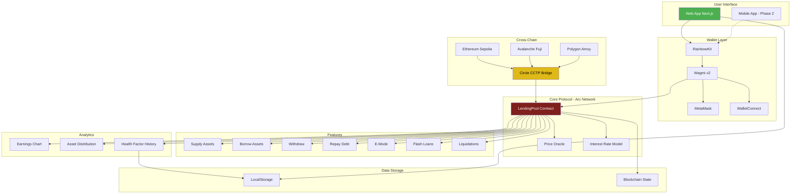

---

## 🔄 USER FLOWS

### **1. SUPPLY FLOW**

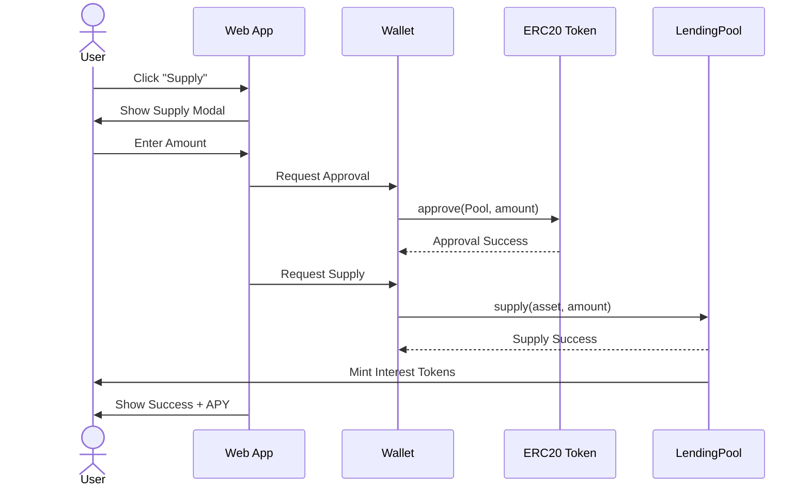

---

### **2. BORROW FLOW**

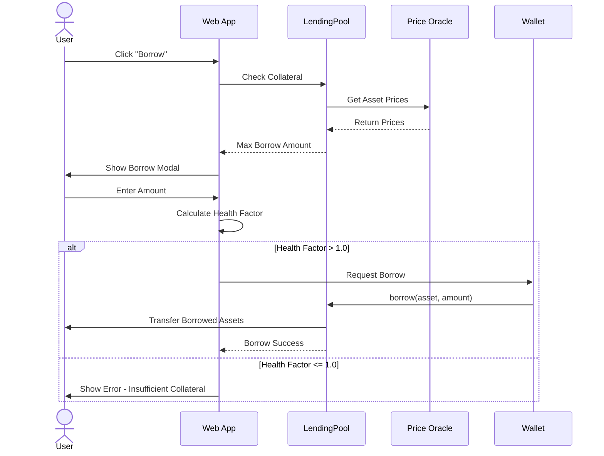

---

### **3. LIQUIDATION FLOW**

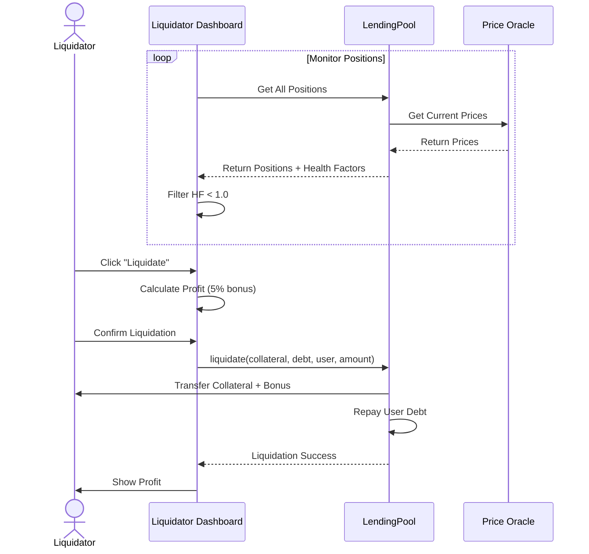

---

### **4. FLASH LOAN FLOW**

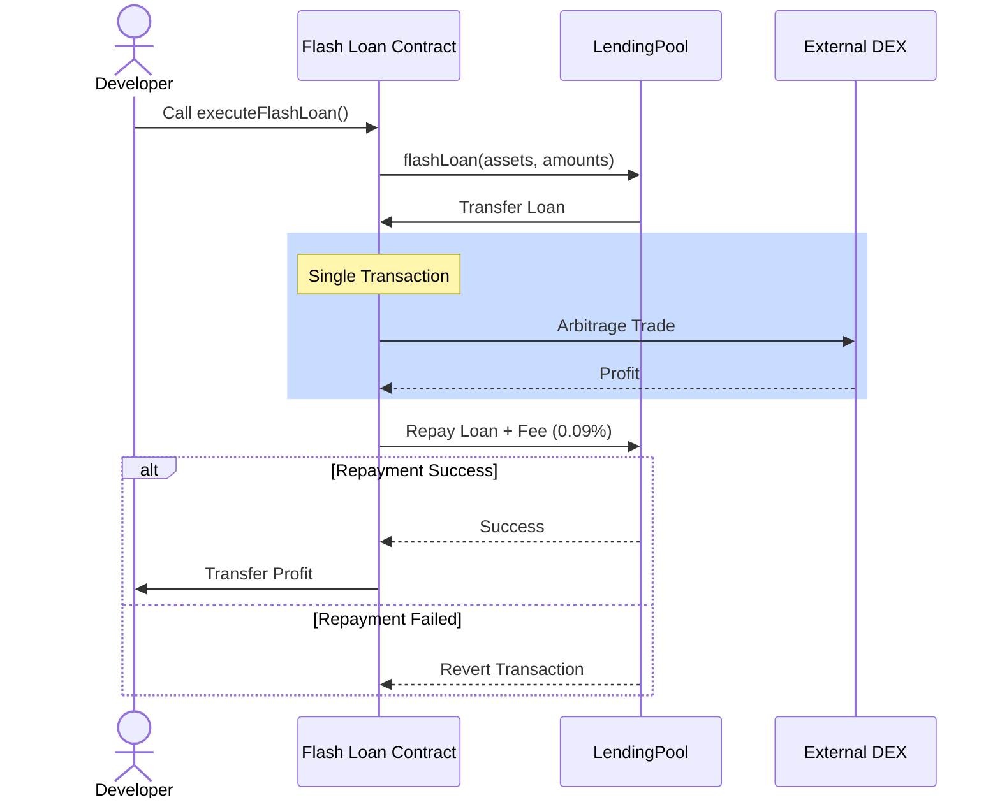

---

### **5. CROSS-CHAIN BRIDGE FLOW**

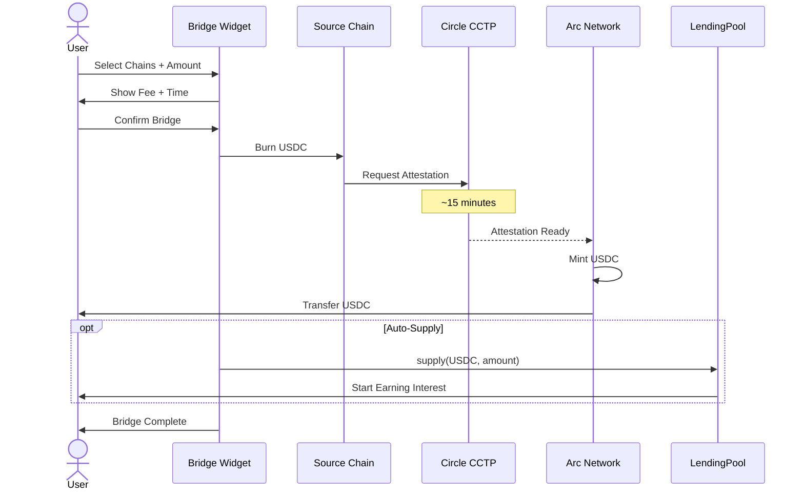

---

## 🏗️ SYSTEM ARCHITECTURE

### **Layer 1: Frontend**

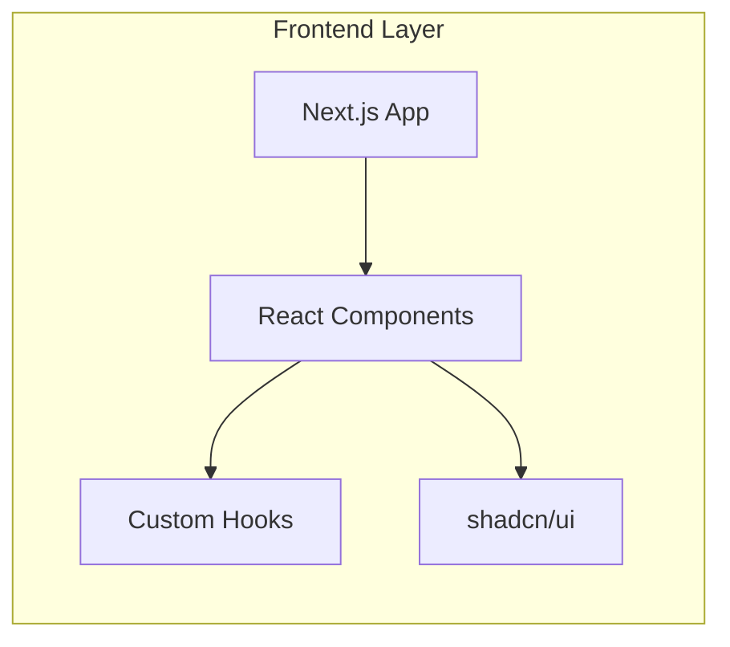

---

### **Layer 2: Blockchain Interaction**

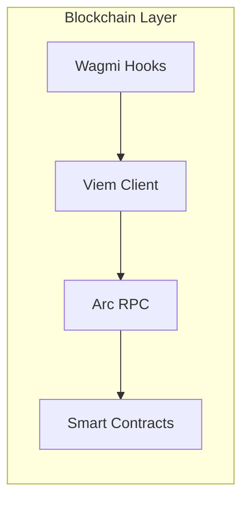

---

### **Layer 3: Smart Contracts**

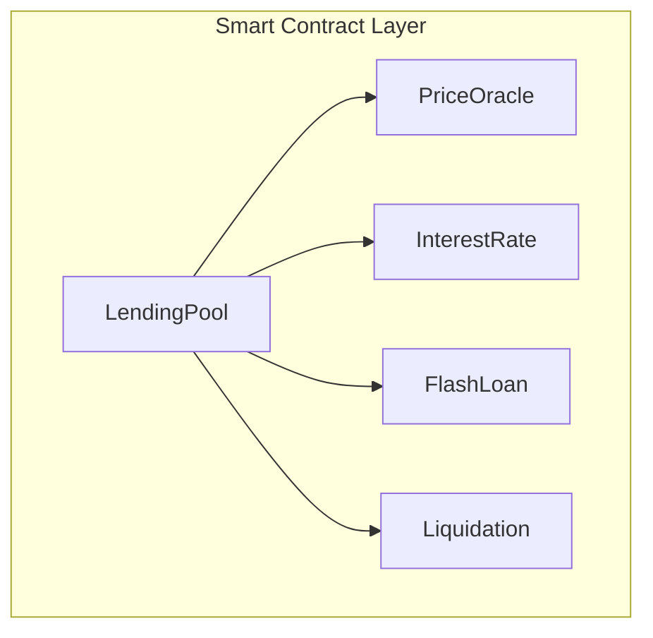

---

## 📊 DATA FLOW

### **Real-time Data Updates**

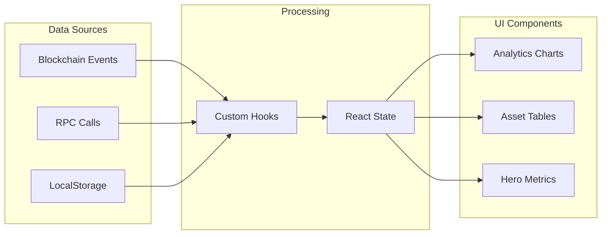

---

## 🔐 SECURITY FLOW

### **Transaction Security**

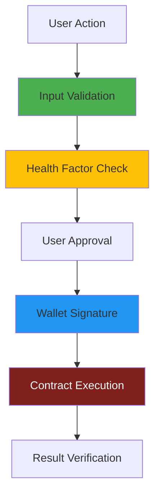

---

## 🎯 PHASE 2 ADDITIONS

### **Governance Flow (Planned)**

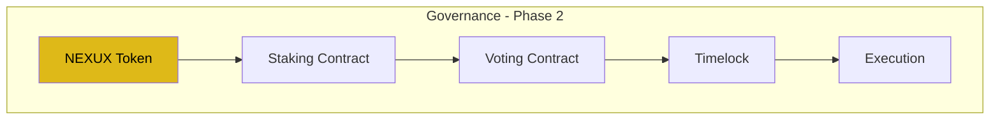

---

**Flowchart Version:** 2.0  
**Last Updated:** December 12, 2024  
**Status:** Production Ready
