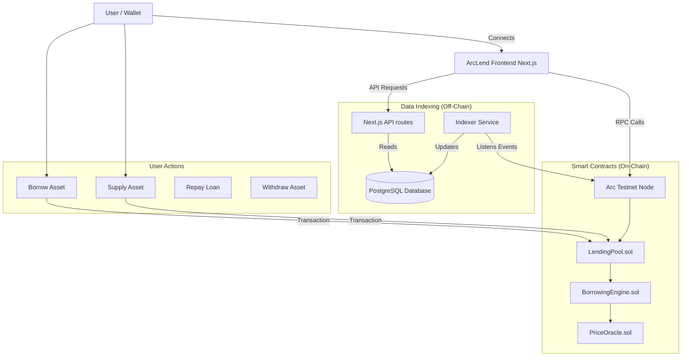
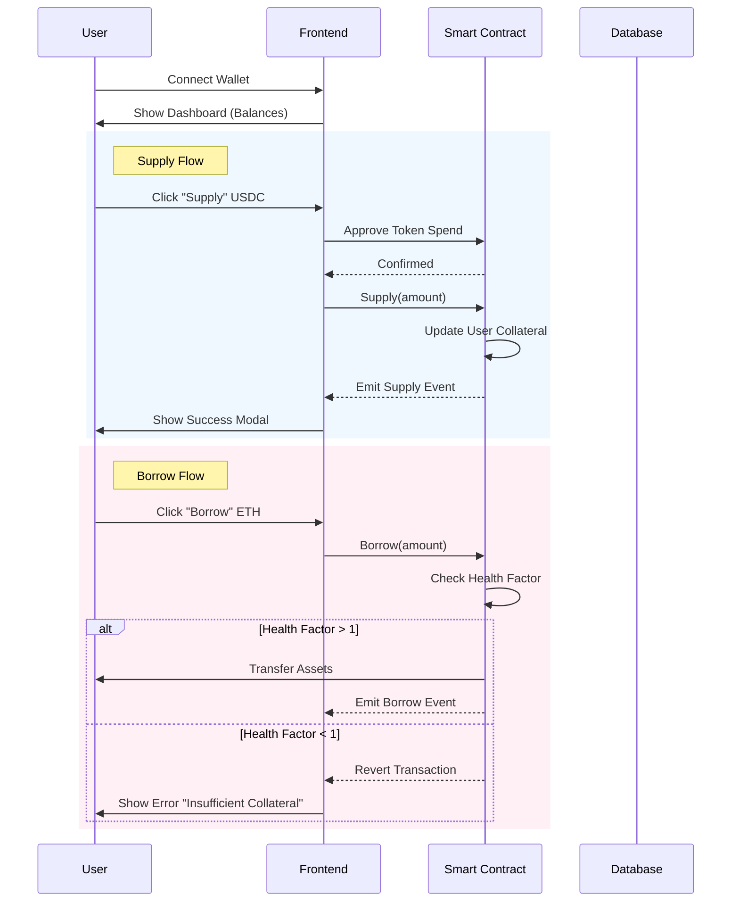

# ArcLend Protocol - User Flow & Architecture

```mermaid
graph TD
    User[User / Wallet] -->|Connects| Frontend[ArcLend Frontend Next.js]
    Frontend -->|RPC Calls| Node[Arc Testnet Node]
    Frontend -->|API Requests| Backend[Next.js API routes]
    
    subgraph "Smart Contracts (On-Chain)"
        Node --> LendingPool[LendingPool.sol]
        LendingPool --> BorrowingEngine[BorrowingEngine.sol]
        BorrowingEngine --> PriceOracle[PriceOracle.sol]
    end

    subgraph "User Actions"
        direction TB
        Supply[Supply Asset]
        Borrow[Borrow Asset]
        Repay[Repay Loan]
        Withdraw[Withdraw Asset]
    end

    User --> Supply
    User --> Borrow
    Supply -->|Transaction| LendingPool
    Borrow -->|Transaction| LendingPool

    subgraph "Data Indexing (Off-Chain)"
        Indexer[Indexer Service] -->|Listens Events| Node
        Indexer -->|Updates| DB[(PostgreSQL Database)]
        Backend -->|Reads| DB
    end
```

## User Journey Flow

```mermaid
sequenceDiagram
    participant U as User
    participant FE as Frontend
    participant SC as Smart Contract
    participant DB as Database

    U->>FE: Connect Wallet
    FE->>U: Show Dashboard (Balances)
    
    rect rgb(240, 248, 255)
        note right of U: Supply Flow
        U->>FE: Click "Supply" USDC
        FE->>SC: Approve Token Spend
        SC-->>FE: Confirmed
        FE->>SC: Supply(amount)
        SC->>SC: Update User Collateral
        SC-->>FE: Emit Supply Event
        FE->>U: Show Success Modal
    end

    rect rgb(255, 240, 245)
        note right of U: Borrow Flow
        U->>FE: Click "Borrow" ETH
        FE->>SC: Borrow(amount)
        SC->>SC: Check Health Factor
        alt Health Factor > 1
            SC->>U: Transfer Assets
            SC-->>FE: Emit Borrow Event
        else Health Factor < 1
            SC-->>FE: Revert Transaction
            FE->>U: Show Error "Insufficient Collateral"
        end
    end
```
